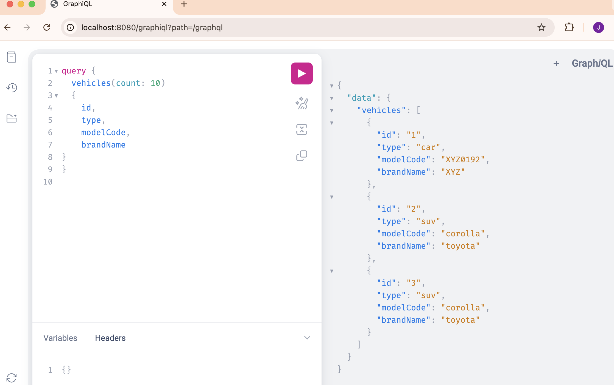

This is a demo of GraphQL in java. Modeled after this example
[https://dzone.com/articles/a-beginners-guide-to-graphql-with-spring-boot](https://dzone.com/articles/a-beginners-guide-to-graphql-with-spring-boot)
It is updated with newer versions of dependencies, with different way to do mutation and query resolving.

This example uses the in-memory h2 database to maintain a list of vehicles.

GraphQL let you define you data, make changes (mutation) or query as you specified using a predefined graphql properties file. See vehicleql.graphqls

You can launch the graphiql graphical interface with [http://localhost:8080/graphiql](http://localhost:8080/graphiql).


 
Use this to insert (a mutation)


```
mutation {
  createVehicle(type: "car", modelCode: "XYZ0192", brandName: "XYZ", launchDate: "2016-08-16") 
  {
    id
  }
}
```
Use this to retrieve one vehicle back 

```
query {
  vehicle(id: 1) 
  {
    id, 
    type, 
    modelCode
}
}
```

Use this to retrieve all vehicles (limit=10) back 

```
query {
  vehicles(count: 10) 
  {
    id, 
    type, 
    modelCode,
    brandName
}
}
```


The H2 console is enabled, look in the log for the jdbc string to look at the table.

